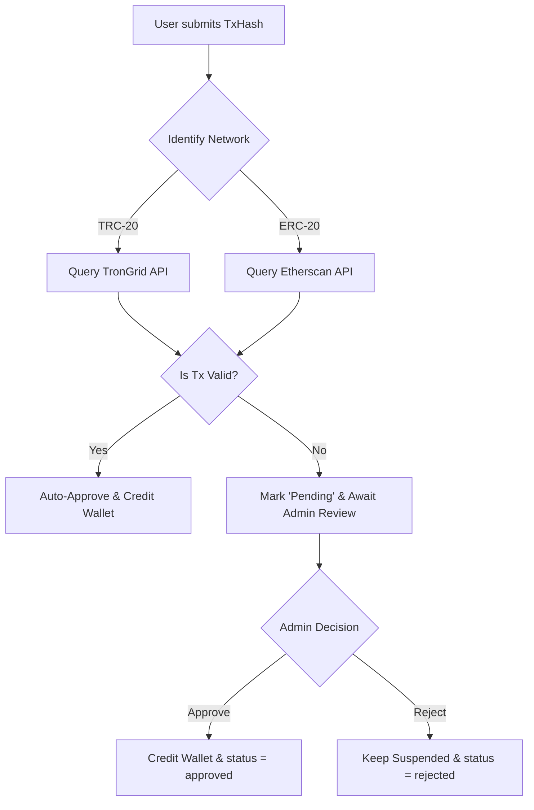
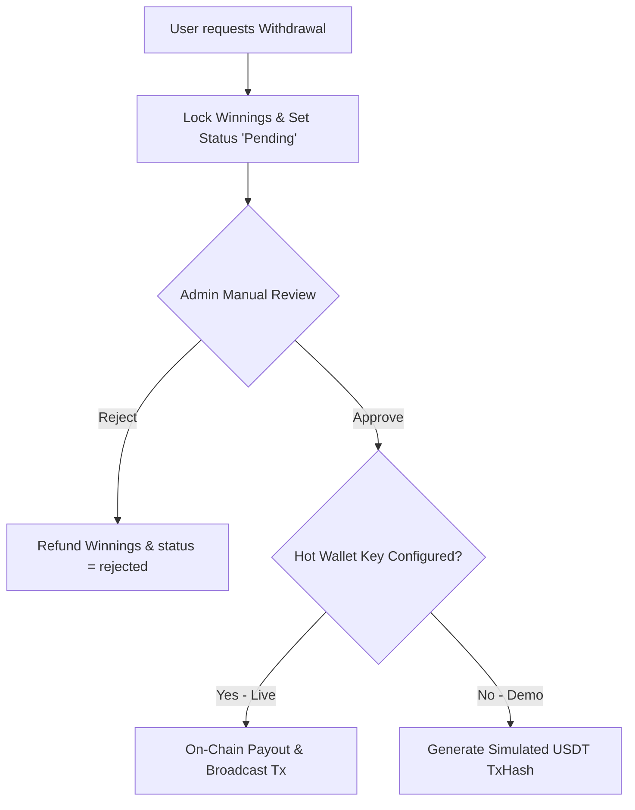

# iDubbl Platform — Competitive Gaming Platform

iDubbl is a state-of-the-art competitive gaming platform where users can sign up, deposit USDT (via TRC-20 or ERC-20 networks), compete in multiplayer matches, earn winnings, and withdraw funds directly back to their personal crypto wallets.

The platform provides a player-facing game/wallet dashboard alongside a fully-featured admin panel for manual transactions oversight, platform ledgers, and matching analytics.

---

## 🛠️ Architecture & Tech Stack

For a detailed deep-dive into transaction pipelines, internal/external wallets design, database schemas, and system flows, please refer to the [Architecture & Flow Documentation](ARCHITECTURE.md).

Our platform relies on a distributed architecture split into Frontend and Backend layers:

### 1. Servers & Services
* **Backend Hosting:** Node.js + Express.js API hosted on [Render.com](https://render.com) (handles matchmaking, websocket connections, and secure payout actions).
* **Frontend Hosting:** React + Vite static build hosted on [Render.com](https://render.com) or custom static hosts.
* **Database:** MongoDB Atlas (Cloud database) for secure and scalable persistence.
* **Websockets:** Socket.io for real-time score tracking, instant duel matching, and chat notifications.
* **Supported Crypto:**
  * **USDT (TRC-20):** Signed using `TronWeb` and tracked via the TronGrid API.
  * **USDT (ERC-20):** Signed using `Ethers.js` with Alchemy RPC nodes, tracked via the Etherscan API.
* **Caching System:**
  * **L1 Cache (Hot):** Bounded In-Process Memory LRU Cache (max size of 1000 items) for ultra-fast, single-process reads.
  * **L2 Cache (Warm):** Redis cache layer (`ioredis` client) equipped with a `RedisCircuitBreaker` wrapper that fails-safe to the L3 cache if Redis is down.
  * **L3 Cache (Cold):** Persistent database-backed API caching storing values inside the `api_cache` MongoDB collection.
* **Payment Gateways:**
  * **Juspay:** Integrated adapter for processing card and local payment methods.
  * **Flutterwave:** Integrated adapter for African payments and currency support.
* **Authentication:**
  * Powered by **Better-Auth** using standard email and password credentials, storing details inside the `user`, `session`, `account`, and `verification` MongoDB collections.

### 2. Stack Summary
* **Frontend:** React, Zustand (State Management), TailwindCSS, React Router, Socket.io-client.
* **Backend:** Node.js (ESM), Express, Socket.io, Better-Auth, MongoDB driver, Redis (`ioredis`), Ethers.js, TronWeb.

---

## 🌲 Business Decision Trees

### A. Deposit Verification Flow


### B. Withdrawal / Payout Flow


---

## 🚀 How to Run Locally

Follow these steps to run the complete environment on your machine:

### Prerequisites
* **Node.js** (v18 or higher recommended)
* **MongoDB** (Local instance or MongoDB Atlas URI)

### 1. Clone & Set Up Environments
Create a `.env` file in both `/backend` and the root folder based on their `.env.example` templates. 

For the backend `/backend/.env`:
```env
PORT=5000
MONGODB_URI=mongodb+srv://<user>:<password>@cluster.mongodb.net/idubbl
BETTER_AUTH_SECRET=generate-a-long-random-secret
BETTER_AUTH_URL=http://localhost:5000

TRONGRID_API_KEY=your-trongrid-api-key
ETHERSCAN_API_KEY=your-etherscan-api-key
ETH_PROVIDER_URL=https://eth-mainnet.g.alchemy.com/v2/your-alchemy-key

# Optional (If not provided, runs in simulation/dry-run mode)
TRONGRID_BASE_URL=https://api.shasta.trongrid.io # or https://api.trongrid.io for mainnet
TRON_HOT_WALLET_PRIVATE_KEY=your-payout-tron-private-key
ETH_HOT_WALLET_PRIVATE_KEY=your-payout-ethereum-private-key
```

### 2. Install Dependencies & Start Backend
```bash
cd backend
npm install
npm run dev
```
The server will start on [http://localhost:5000](http://localhost:5000).

### 3. Install Dependencies & Start Frontend
Open a new terminal window:
```bash
cd frontend
npm install
npm run dev
```
The frontend application will start on [http://localhost:5173](http://localhost:5173).

---

## 🛠️ Database Maintenance Scripts

Inside the `backend/scripts` directory are several useful utilities:

* **Reset Database:** Drops all existing collections (accounts, wallets, transactions, sessions) to start from clean state.
  ```bash
  node backend/scripts/resetDb.js
  ```
  Script source: [resetDb.js](backend/scripts/resetDb.js)
* **Seed Admin Account:** Registers and promotes a clean admin account.
  ```bash
  node backend/scripts/seedAdmin.js
  ```
  Script source: [seedAdmin.js](backend/scripts/seedAdmin.js)

---

## ☁️ Deployment

We deploy backend & frontend services to **Render.com**. 

### 1. Render Deployment Config
The configuration is declared in [render.yaml](render.yaml):
* **Web Service (Backend):** Deployed via node entry point, listening on dynamic port environment variable.
* **Static Site (Frontend):** Builds React bundle (`npm run build`) and publishes the `dist/` output.

### 2. Production Checklist
Before launching the service to real users:
1. Ensure `TRONGRID_BASE_URL` is set to `https://api.trongrid.io` (Mainnet).
2. Configure `TRON_HOT_WALLET_PRIVATE_KEY` and `ETH_HOT_WALLET_PRIVATE_KEY` inside Render Environment variables to allow automatic payout execution.
3. Fund both hot wallets with TRX (for TRC-20 gas), ETH (for ERC-20 gas), and standard USDT.
4. Set up Render cron health pings to prevent cold-starts.
